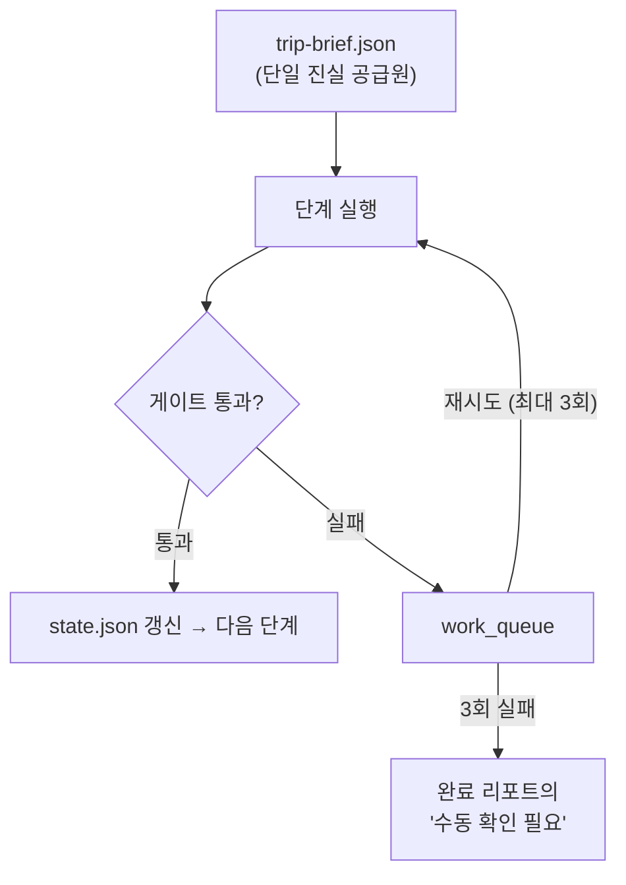

# Travel Automation — 여행 자동화 플러그인

여행 일정 한 줄이면 **Notion 가이드북 · 구글맵 지도 · 사진과 AI 일러스트 · Google Calendar · PowerPoint · 지출 관리**까지 만들어 주는 Claude 플러그인입니다. Claude 앱(claude.ai·데스크톱)과 Claude Code에서 함께 쓸 수 있습니다.

| 항목 | 내용 |
|---|---|
| 현재 버전 | **v3.2.1** (2026-10-05) |
| 구성 | 스킬 21개 · 명령어 8개 · 보조 스크립트 2개 · 번들 커넥터 2개 |
| 상태 | 작성자가 실제 여행 준비에 쓰는 최종본과 같은 구성 (예시값 일반화, 커넥터 설정 수정만 다름) |
| 산출물 언어 | 한국어 (네이버 블로그·카페 기반 한국인 여행자 관점 리서치 포함) |
| 변경 이력 | [UPDATES.md](UPDATES.md) |
| 라이선스 | [MIT](LICENSE) |

---

## 목차

1. [무엇을 만들어 주나](#무엇을-만들어-주나)
2. [빠른 시작](#빠른-시작)
3. [사전 준비](#사전-준비)
4. [동작 방식](#동작-방식)
5. [스킬 21개](#스킬-21개)
6. [명령어 8개](#명령어-8개)
7. [구글맵 연동에 관하여](#구글맵-연동에-관하여)
8. [계획에서 정산까지](#계획에서-정산까지)
9. [작업 디렉터리와 저장소 구조](#작업-디렉터리와-저장소-구조)
10. [알려진 제약](#알려진-제약)
11. [치명적 규칙 요약](#치명적-규칙-요약)
12. [업데이트 내역](#업데이트-내역)
13. [문의와 기여](#문의와-기여)
14. [라이선스](#라이선스)
15. [English summary](#english-summary)

---

## 무엇을 만들어 주나

| 산출물 | 내용 |
|---|---|
| 📘 Notion 가이드북 | 메인 페이지 → 날짜별 상세 페이지 → 참고 자료(체크리스트·긴급 정보·비용·아이 교육용 도감 등) |
| 🗺️ 지도 | 날짜별 임베드 지도, 모바일 내비 딥링크, 장소별 좌표 링크 표, Google My Maps용 KML·CSV |
| 🖼️ 사진·일러스트 | 스팟당 2장 이상 스톡 사진(Pexels) + gpt-image-2 여정 요약·날짜별 일러스트(선택) |
| 📅 캘린더 | 관광·이동·식사·체크인 일정을 Google Calendar에 등록 |
| 📊 발표 자료 | 날짜별·스팟별 PowerPoint(.pptx) |
| 💵 지출 관리 | Notion 지출 데이터베이스 + 경비 총괄 페이지, 영수증 사진 자동 등록 |
| 🧳 그 밖에 | 짐 싸기 체크리스트, 긴급 정보 카드, 예상 비용표 |

---

## 빠른 시작

### 1. 설치 — Claude 앱 (claude.ai · 데스크톱)

1. **Customize > Plugins**를 엽니다.
2. **Add > Add marketplace**를 누르고 `DrugnSafety/travel-automation`을 입력합니다.
3. 목록에 나타난 **travel-automation**을 추가합니다.

- 저장소를 ZIP으로 내려받아 **Add > Upload plugin**으로 올려도 됩니다. 압축 파일 안에 `.claude-plugin/plugin.json`이 하나 들어 있으면 됩니다.
- 마켓플레이스로 추가하면 이 저장소가 갱신될 때 **Check for updates**(또는 **Sync automatically**)로 새 버전을 받을 수 있습니다. ZIP 업로드는 수동 갱신입니다.
- 한 번 추가하면 같은 계정의 채팅·Cowork·Claude Code에서 함께 쓸 수 있습니다.

### 2. 설치 — Claude Code

```
/plugin marketplace add DrugnSafety/travel-automation
/plugin install travel-automation@travel-automation
/reload-plugins
```

터미널에서 바로 설치하려면 다음을 실행합니다.

```bash
claude plugin marketplace add DrugnSafety/travel-automation
claude plugin install travel-automation@travel-automation
```

### 3. 첫 실행

```
/travel-automation:new-trip 5월 샌프란시스코·요세미티 5박 6일, 성인 2 + 아이 1, 렌터카
```

- 일정표 파일(PDF·엑셀·메모)이나 참고할 블로그·카페 URL을 함께 주면 그대로 반영합니다.
- 맨 먼저 `travel-intake`가 6개 블록의 질문(최대 3회)으로 요일·차량 제약·숙소·지도·이미지·산출물을 확정하고 `trip-brief.json`을 만듭니다. 이후 단계는 이 파일만 읽으므로 같은 질문을 다시 하지 않습니다.
- 채팅에서는 메시지 창에 `/`를 입력해 `travel-automation` 명령을 고르거나, "여행 가이드 만들어줘"처럼 요청해도 됩니다.

---

## 사전 준비

**필수**

- **Notion 커넥터** — 가이드북과 지출 DB를 만들 때 씁니다.

**강력 권장**

- **PlayMCP NaverSearch** — 한국어 블로그·카페·지식iN 리서치(`travel-naver-search`)에 씁니다. 없으면 한국어 후기 수집을 건너뛰거나 웹 검색으로 대신하며, 네이버 출처를 채우지 못한 스팟은 리서치 게이트에서 "수동 확인 필요"로 남을 수 있습니다.

**선택** — 없으면 해당 단계만 건너뜁니다.

| 필요한 것 | 쓰는 곳 |
|---|---|
| Google Calendar 커넥터 | 일정 등록 (`travel-calendar-sync`) |
| PowerPoint MCP 또는 Node.js + `pptxgenjs` | PPT 생성 (`travel-presentation`) |
| OpenAI API 키 + 이미지 생성 도구 | AI 일러스트 (`travel-illustration`) — [설정](#ai-일러스트-설정-선택) |
| Python 3 + Pillow · pillow-heif · poppler-utils | 영수증 정규화 (`receipt_intake.py`). Pillow가 없으면 JPG·PNG는 원본 그대로 쓰고, HEIC(pillow-heif 필요)·PDF(poppler-utils 필요)는 처리하지 못해 경고만 남깁니다 |

> 커넥터가 없다고 작업이 멈추지는 않습니다. 각 스킬은 웹 검색으로 대신하고, "이 커넥터를 연결하면 더 정확해진다"고 한 번 안내합니다.

### 번들 커넥터 (`.mcp.json`)

| 서버 | 용도 |
|---|---|
| `kiwi-flights` | Kiwi.com 항공편 검색 (`search-flight`) · 인증 불필요 |
| `trivago-hotels` | trivago 숙소 가격·평점 비교 · 인증 불필요 |

- **Claude 앱**: 플러그인을 추가해도 커넥터가 자동으로 연결되지는 않습니다. **Customize > Plugins**에서 이 플러그인을 열고 **Connectors** 탭에서 추가·연결하세요.
- **Claude Code**: 플러그인을 켜면 함께 로드됩니다. `/mcp`에서 상태를 확인할 수 있습니다.

### 직접 연결하면 좋은 커넥터

| 커넥터 | 여행에서의 쓸모 |
|---|---|
| TomTom Maps | 지오코딩·POI 검색·경로 계산 (인증 필요) |
| Tripadvisor | 명소·호텔 리뷰 교차 검증 |
| Felt Maps | 공유 가능한 웹 지도 (인증 필요) |
| Google Maps (Composio) | 장소 상세·리뷰·영업시간 — Composio API 키와 계정별 URL 필요 (`travel-spot-reviews` 참고) |
| LILT | 현지 언어 번역 — LILT 기업 계정 OAuth 필요 |

### AI 일러스트 설정 (선택)

API 키는 환경변수 `OPENAI_API_KEY` 또는 `~/.config/gpt-image/.env`에서 읽습니다.

```bash
mkdir -p ~/.config/gpt-image
printf 'OPENAI_API_KEY=sk-...\n' > ~/.config/gpt-image/.env
chmod 600 ~/.config/gpt-image/.env
```

- 실제 생성은 `moai-media` 플러그인의 `media-gpt-image2-builder`·`image-gen` 스킬이 있으면 그쪽에 맡기고, 없으면 `gpt-image-prompt-picker` 스킬의 `generate.py`를 호출합니다. **두 도구 모두 이 저장소에 들어 있지 않습니다.** 준비되지 않았다면 일러스트를 생략하세요.
- 이미지 생성은 유료입니다. 플러그인은 1장으로 방향을 먼저 확인받은 뒤 나머지를 두세 장씩 나눠 만듭니다.
- API 키를 대화창에 붙여넣지 마세요. 붙여넣었다면 그 키는 폐기하고 새로 발급하세요.

---

## 동작 방식

v3는 상태 기반 하네스(harness)로 돌아갑니다. 각 단계는 게이트를 통과해야 완료 처리되고, 실패한 항목은 워크 큐에 남아 최대 3회 자동 재시도됩니다. 그래도 실패하면 조용히 버리지 않고 완료 리포트의 "수동 확인 필요"에 사유와 시도 이력을 남깁니다.



| 단계 | 하는 일 · 스킬 | 통과 조건(게이트) |
|---|---|---|
| S0 인테이크 | 조건 확정, `trip-brief.json` 생성<br>`travel-intake` | 요일 매핑을 계산해 사용자 확인 |
| S1 리서치 | 스팟별 배경·팁·비용 + 한국어 후기<br>`travel-research` `travel-naver-search` `travel-url-ingest` | 스팟별 6개 카테고리, 네이버 출처 1건 이상 |
| S2 스캐폴드 | 노션 페이지 뼈대 생성<br>`notion-travel-page` | 모든 페이지 ID 확보·조회 성공 |
| S3 본문 | 본문 작성<br>`notion-travel-page` | 한글 무결성 검사 통과 |
| S4 사진 | 스톡 사진 삽입·검증<br>`travel-image-search` → `travel-image-validator` | 스팟당 최소 장수, 모든 URL HTTP 200 |
| S5 일러스트 | AI 일러스트 (선택)<br>`travel-illustration` | 요약 1장 + 날짜별 전량 삽입 |
| S6 지도 | 지도·딥링크·KML·CSV<br>`travel-maps-integration` | 모든 날짜에 지도 섹션, KML 파싱, 좌표 범위 검증 |
| S7 보강 | 스팟 상세·리뷰·짐·긴급·교통<br>`travel-content-enrichment` `travel-spot-reviews` `travel-packing-list` `travel-emergency-info` `travel-transport-info` | 스팟별 5개 블록 완비 |
| S7.5 지출 | 지출 DB·경비 총괄 페이지<br>`travel-expense-db` | 소계 합 = 총액, 보증금 제외 |
| S8 감사 | 12개 항목 감사 → 자동 수정 → 재검증<br>`travel-quality-loop` | 12개 체크 통과 (최대 3회 순환) |
| S9 산출 | 캘린더·PPT·엑셀<br>`travel-calendar-sync` `travel-presentation` xlsx 스킬 | 파일 전달, `report.md` 작성 |

정보를 어디서 가져올지 애매할 때는 `travel-external-sources`의 소스 라우팅 규칙을 따릅니다.

### 인테이크가 미리 잡는 것

과거 운영에서 전면 재작업을 일으킨 항목들입니다.

| 사고 | 실제로 벌어진 일 | v3의 처리 |
|---|---|---|
| 요일 오산 | 전 일정의 요일이 하루씩 밀림 | 계산해서 사용자에게 확인받음 (추론 금지) |
| 차량 제약 미확인 | RV가 통과할 수 없는 도로를 일정에 넣음 | 터널 폭·높이, 차량 길이 제한을 직접 조사해 반영 |
| 숙소 위치 오해 | 공원 밖 캠핑장을 공원 안으로 표기 | 모든 숙소에 "공원 내/밖"을 필수로 표기 |
| 예약처 분산 | 한 공원 안에서 운영사가 3곳 | 캠핑장별 예약처·전화번호를 개별 조사 |
| 이미지 부족 | 스팟당 1장 → 2장으로 재작업 | 최소 장수를 정책값으로 강제 |
| 일러스트 오해 | 스톡 사진 대체재로 오해해 전량 재생성 | 두 산출물의 용도를 명시적으로 분리 |
| 한글 깨짐 | 유니코드 이스케이프로 전 페이지 파손 | 작성 규칙 + 무결성 게이트 |
| 지도 부재 | 완성 후 요청 → 11개 페이지 재편집 | 초기 질문에서 연동 범위 확정 |

---

## 스킬 21개

### 시작 · 오케스트레이션

| 스킬 | 역할 |
|---|---|
| `travel-intake` | 6개 블록 질문으로 `trip-brief.json` 생성. **모든 작업의 출발점** |
| `travel-orchestrator` | 하네스 + 게이트 + 워크 큐로 전체 파이프라인 실행·재개·부분 실행 |
| `travel-quality-loop` | 12개 체크리스트 감사(한글 파손·요일·이미지·좌표·링크 등) → 자동 수정 → 재검증 |

### 리서치 · 정보 소스

| 스킬 | 역할 |
|---|---|
| `travel-research` | 스팟별 역사·문화, 지질, 가족 여행 팁, 포토 스팟, 맛집, 예상 비용 리서치 |
| `travel-naver-search` | 네이버 블로그·카페·지식iN·뉴스로 한국인 여행자 관점 정보 수집 |
| `travel-url-ingest` | 네이버 카페·블로그 등 막힌 URL 본문 확보 (6단계 폴백) |
| `travel-external-sources` | 정보 유형별 소스 라우팅, 신뢰도 우선순위, 교차 검증 규칙 |
| `travel-spot-reviews` | 구글 지도·커뮤니티 리뷰에서 스팟별 실용 팁과 주의사항 수집 |
| `travel-transport-info` | 항공·렌터카·기차 예약 확인 메일·PDF·스크린샷을 읽어 교통 정보 섹션 생성 |

### 노션 가이드북

| 스킬 | 역할 |
|---|---|
| `notion-travel-page` | 메인·날짜별·참고 자료 페이지 생성, 한글 파손·하위 페이지 아카이빙 등 Notion 함정 회피 |
| `travel-content-enrichment` | 스팟별 6가지 상세 블록 보강 (역사, 아이와 함께하는 팁, 포토 스팟, 맛집, 비용, 블로그 검색어) |

### 이미지

| 스킬 | 역할 |
|---|---|
| `travel-image-search` | Pexels CDN 우선(Unsplash 보조), 용도별 폭(커버 1600·본문 1280·표 640px), 스팟당 2장 이상, 삽입 전 curl 검증 |
| `travel-image-validator` | 삽입된 이미지의 HTTP 상태·형식 검사, 깨진 이미지 자동 교체 |
| `travel-illustration` | gpt-image-2로 여정 요약 + 날짜별 일러스트 생성 (스톡 사진과 별개 산출물) |

### 지도

| 스킬 | 역할 |
|---|---|
| `travel-maps-integration` | 좌표 기반 지도 임베드·내비 딥링크·좌표 링크 표, KML·CSV·경로 URL 생성 (`scripts/build_map_assets.py`, 표준 라이브러리만 사용) |

### 산출물

| 스킬 | 역할 |
|---|---|
| `travel-calendar-sync` | 관광·이동·식사·체크인/아웃 일정을 Google Calendar에 등록 |
| `travel-presentation` | 날짜별·스팟별 PowerPoint 생성 (PowerPoint MCP, 없으면 pptxgenjs) |
| `travel-packing-list` | 기후·기간·활동·인원(아이 연령)을 반영한 짐 싸기 체크리스트 |
| `travel-emergency-info` | 병원·약국·대사관(영사관)·긴급전화·교통법규·보험 정보 카드 |

### 지출 관리

| 스킬 | 역할 |
|---|---|
| `travel-expense-db` | 지출 관리 Notion DB + 경비 총괄 페이지 생성 (분류별 소계·현금 흐름·카드 배분) |
| `travel-receipt-ocr` | 영수증 사진·PDF를 읽어 지출 DB에 등록, 원본 첨부, 예상 대비 대사 (`scripts/receipt_intake.py`) |

---

## 명령어 8개

명령은 `/travel-automation:<명령>` 형식으로 실행합니다. 예: `/travel-automation:new-trip`

| 명령 | 하는 일 · 인자 |
|---|---|
| `new-trip` | 인테이크 → S1–S9 전체 실행<br>`<여행 일정 설명 또는 파일>` |
| `trip-audit` | 생성된 가이드 전체 점검·자동 수정<br>`[노션 페이지 URL 또는 trip_slug]` |
| `trip-map` | 구글맵 연동만 실행 (임베드·내비 링크·KML)<br>`[trip_slug 또는 노션 페이지 URL]` |
| `trip-images` | 사진·일러스트 보강만 실행<br>`[trip_slug] [--photos \| --illustrations \| --all]` |
| `trip-expense` | 지출 DB + 경비 총괄 페이지 생성<br>`[trip_slug] [--rebuild]` |
| `trip-receipt` | 영수증 사진·PDF를 지출 DB에 등록<br>`[파일 경로들]` 또는 첨부 |
| `trip-budget` | 예상 비용 스프레드시트 생성<br>`<여행지> <기간> <인원>` |
| `trip-checklist` | 맞춤형 준비물 체크리스트 생성<br>`<여행지> <기간> <인원>` |

---

## 구글맵 연동에 관하여

**구글은 개인 "저장됨(Saved)" 목록에 외부에서 장소를 추가하는 공개 API를 제공하지 않습니다.** Places API는 읽기 전용이고, 브라우저 자동화로 별표를 누르는 방식은 봇 차단 때문에 실무에서 실패합니다.

그래서 이 플러그인은 **Google My Maps + KML 가져오기**를 표준 경로로 씁니다. PC 브라우저에서 몇 분이면 수십 개 장소를 Day별 폴더 구조로 한 번에 올릴 수 있고, 가져온 지도는 휴대폰 구글맵 앱의 "저장됨 → 지도" 탭에 나타납니다. 이 제약은 작업이 끝난 뒤가 아니라 **초기 질문 단계에서 미리 알립니다.**

---

## 계획에서 정산까지

```
travel-expense-db      →  💵 지출 관리 DB  +  🧾 경비 총괄 페이지
        │                        ▲
        │                        │  행 추가 + 영수증 원본 첨부
        ▼                        │
travel-receipt-ocr  ──  영수증 사진 → 추출 → 검증 → 등록 → 대사
```

**OCR을 외부 서비스에 맡기지 않습니다.** 영수증은 Claude가 이미지를 직접 보고 읽습니다. 스크립트는 사람이 눈으로 하면 틀리는 일만 맡습니다 — EXIF 회전 보정, 리사이즈, PDF 페이지 분할, 형식 검증, 중복 판정, 예상 대비 대사.

| 함정 | 실제로 벌어지는 일 |
|---|---|
| 미국 식당 영수증 | 인쇄된 TOTAL은 **팁 전 금액**입니다. 그대로 넣으면 15\~20% 적게 잡힙니다 |
| 마트 영수증 | 침구와 식료품이 한 장에 섞입니다. 한 행으로 뭉개면 분류가 무너집니다 |
| 같은 영수증 재업로드 | 등록 전 현재 DB를 내려받지 않으면 중복이 그대로 들어갑니다 |
| 환불성 보증금 | 총액에 넣으면 여행 경비가 실제보다 커 보입니다 |
| 요약 페이지 | DB만 고치고 두면 두 숫자가 어긋납니다 |
| 통신 두절 | 국립공원 안에서는 며칠씩 못 올립니다. 배치 처리를 전제로 설계했습니다 |

카드번호는 뒷 4자리만 기록합니다.

---

## 작업 디렉터리와 저장소 구조

주요 상태 파일은 `/tmp/{trip_slug}/` 아래에 모입니다. 일부 보조 스킬은 `/tmp/{여행지}_*.json` 같은 별도 경로를 쓰고, PPT는 사용자 작업 폴더에 저장합니다.

```
/tmp/{trip_slug}/
├── trip-brief.json      입력 (단일 진실 공급원, 오케스트레이터는 수정하지 않음)
├── state.json           단계 상태 · 페이지 ID · 재시도 카운터
├── work_queue.json      실패 항목 큐
├── research/            스팟별 리서치
├── references/          첨부 URL·문서에서 추출한 구조화 데이터
├── assets/              KML · CSV · 이미지 · 프롬프트
├── receipts/            정규화된 영수증 이미지 + manifest.json
├── ledger.json          지출 DB 스냅샷 (중복 판정용)
└── report.md            완료 리포트
```

저장소 구성은 다음과 같습니다.

```
travel-automation/
├── .claude-plugin/
│   ├── plugin.json          플러그인 매니페스트 (버전)
│   └── marketplace.json     단일 플러그인 마켓플레이스 정의
├── .mcp.json                번들 커넥터 (Kiwi.com, trivago)
├── commands/                명령어 8개 (*.md)
├── skills/                  스킬 21개 (*/SKILL.md)
│   ├── travel-maps-integration/scripts/build_map_assets.py
│   └── travel-receipt-ocr/scripts/receipt_intake.py
├── LICENSE                  MIT
├── README.md
└── UPDATES.md               버전별 상세 변경 이력
```

---

## 알려진 제약

- **AI 일러스트는 외부 도구가 필요합니다.** OpenAI API 키와 이미지 생성 도구(`moai-media` 플러그인 또는 `gpt-image-prompt-picker` 스킬)가 있어야 하며, 둘 다 이 저장소에 포함되어 있지 않습니다.
- **구글맵 "저장됨" 목록에는 직접 쓸 수 없습니다.** KML을 Google My Maps로 가져오는 방식을 씁니다.
- **산출물은 한국어 기준입니다.** 네이버 검색 MCP가 없으면 한국인 여행자 관점 정보가 크게 줄어듭니다.
- **비용이 드는 작업이 있습니다.** 이미지 생성(OpenAI)은 유료이고, 리서치·페이지 작성은 사용량을 많이 씁니다. 긴 여행은 날짜를 나눠 병렬로 처리합니다.
- **스킬 설명이 상시 컨텍스트를 차지합니다.** 플러그인을 켜 두면 세션마다 약 5.9k 토큰이 추가됩니다(`claude plugin details travel-automation` 기준). 여행 작업을 하지 않을 때는 꺼 두어도 됩니다.
- **요금·운영시간은 출처 링크로 다시 확인하세요.** 플러그인은 공식 출처를 우선하고 출처를 남기지만, 현지 사정은 바뀔 수 있습니다.

---

## 치명적 규칙 요약

스킬을 고치거나 확장할 때 지켜야 하는 규칙입니다. 대부분 실제 사고에서 나왔습니다.

1. **한글은 문자 그대로 입력합니다.** 유니코드 이스케이프로 조립하면 파손됩니다.
2. **요일은 계산합니다.** 추론하지 않습니다.
3. **`replace_content` + `allow_deleting_content: true`는 하위 페이지를 아카이브합니다.** 하위 페이지가 있는 페이지에는 쓰지 않습니다.
4. **Notion 마크다운에서 물결표는 `\~`, 달러 기호는 `\$`로 씁니다.**
5. **아이콘은 이모지, 커버는 이미지 URL**을 씁니다. 아이콘에 URL을 넣으면 오류가 납니다.
6. **AI 일러스트와 스톡 사진은 별개 산출물**입니다. 서로 대체하지 않습니다.
7. **이미지 URL은 삽입 전 curl로 검증합니다.**
8. **브라우저 자동화는 2회 실패하면 포기하고** 대안으로 전환합니다.
9. **영수증 등록 전 현재 DB를 내려받습니다.** 중복 판정의 유일한 근거입니다.
10. **카드번호는 뒷 4자리만 남깁니다.**

---

## 업데이트 내역

- **v3.2.1** (2026-10-05) — GitHub 공개본을 실사용 최종본과 일치시킴: 누락됐던 스킬 3종(`travel-quality-loop`, `travel-receipt-ocr`, `travel-url-ingest`)과 스크립트 2종 추가, 한글 파손 교정, 폐지 스텁 4종 삭제, `.mcp.json` 검증 오류 수정, 예시 데이터 일반화, README 전면 개편
- **v3.2.0** (2026-08-18) — 설치 가이드 신설, 변경 이력을 `UPDATES.md`로 분리, 저장소 동기화(일부 누락 — v3.2.1에서 보완)
- **v3.1.0** — 상태 기반 하네스·게이트·워크 큐로 전면 재작성, 지출 관리·영수증 등록 추가 (당시 GitHub에는 미반영)
- **최초 공개** (2026-07-07) — 이전 구조(스킬 17개 + 명령어 3개)

전체 이력과 스킬 이름 변경·폐지 매핑은 [UPDATES.md](UPDATES.md)에 있습니다.

---

## 문의와 기여

- 버그나 개선 제안은 [Issues](https://github.com/DrugnSafety/travel-automation/issues)에 남겨 주세요.
- 스킬을 수정해 Pull Request를 보낼 때는 [치명적 규칙 요약](#치명적-규칙-요약)을 지켜 주세요.
- 수정 후 `claude plugin validate .`로 매니페스트와 `.mcp.json`을 검증할 수 있습니다.

---

## 라이선스

[MIT License](LICENSE) — 출처(저작권 표시와 라이선스 문구)를 유지하면 자유롭게 사용·수정·재배포할 수 있습니다.

---

## English summary

<details>
<summary>Click to expand</summary>

**Travel Automation** is a Claude plugin (works in the Claude apps and Claude Code) that turns a single travel itinerary into a Korean-language **Notion guidebook** with day-by-day pages, **Google Maps** embeds, navigation deep links and KML/CSV for Google My Maps, stock photos and optional **gpt-image-2 illustrations**, **Google Calendar** events, a **PowerPoint** deck, and a **Notion expense database** with receipt capture.

- **Install (Claude apps):** Customize > Plugins > Add > Add marketplace → `DrugnSafety/travel-automation`
- **Install (Claude Code):** `/plugin marketplace add DrugnSafety/travel-automation`, then `/plugin install travel-automation@travel-automation`
- **Run:** `/travel-automation:new-trip <itinerary or file>`
- **Requires:** a Notion connector. Strongly recommended: PlayMCP NaverSearch (Korean community research). Optional: Google Calendar, PowerPoint MCP or pptxgenjs, an OpenAI API key plus an image tool for illustrations.
- **Design:** a stateful harness where every stage must pass a gate; failures go to a work queue with up to three retries, and anything still failing is reported for manual review.

Outputs and research are tuned for Korean-speaking travelers. Licensed under the [MIT License](LICENSE).

</details>
